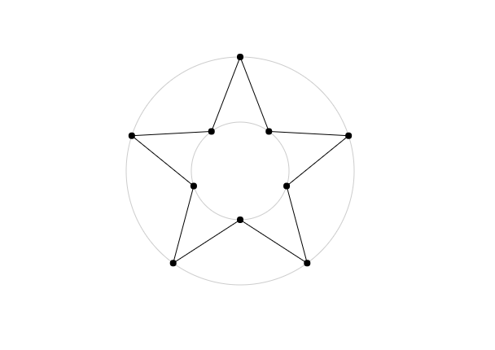
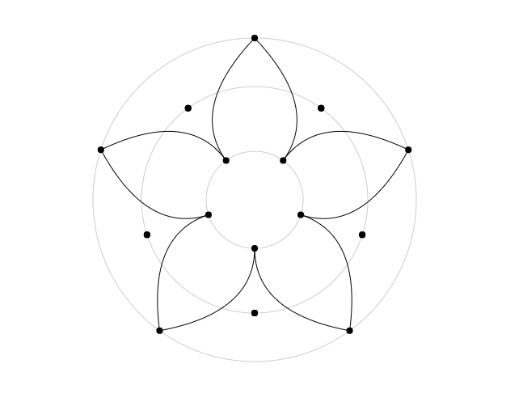
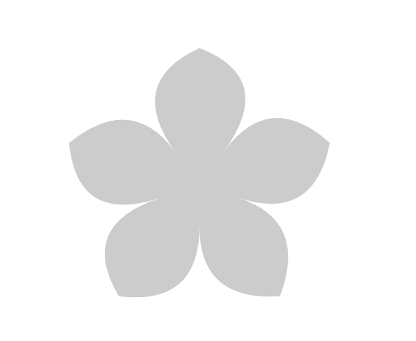

# 从零开始的五毛特效之 - 花雨

追过很多番，特别喜欢《未闻花名》，ED 听了很久，对片尾的花雨效果映像特别深刻。所以这次从零开始实现一个 5 毛版本的花雨效果。

先来看一下花雨的效果：

[那朵花 ED](http://www.bilibili.com/video/av3967393/index_3.html)

大体就是花朵从上往下落，然后静止，缩小，改变颜色后反向运动。


然后这是[五毛实现版](https://codepen.io/kinglisky/pen/mwwWmj)

首先我们需要画出这个五毛的特效中最重要的花，先来看一下动画中的花朵是怎样的：


页面中的花朵的形状与颜色不尽相同，用图片精灵来做肯定是不实际的。使用 SVG 画一朵花还是很简单的，实际操作只需要将图片导入到 AI 或者 Sketch 软件中描出花朵，然后导出的 path 路径，拿到 path 后通过变化路径上点的位置与 fill 填充颜色就能得到不同形状与颜色的花朵了。但考虑到 SVG 各种属性设置都需要修改 SVG 的 DOM 属性，绘制的花朵数量一多，性能就是个大问题。所以这里我们使用 canvas 来实现我们想要的效果。

直接用 canvas 画一朵花还是很没头绪的，但我们可以参考与花朵形状类似的五角星：

[五角星 codepen](https://codepen.io/kinglisky/pen/JJNBpX)




[花朵 codepen](https://codepen.io/kinglisky/pen/JJNaNr)



花朵的形状是不是和五角星很像，只是尖角边两侧多了一个控制点，将直线变成了弧线而已。所以画花瓣的第一步就是取到圆上的路径相关的控制点，
按顺序将它们连接就行了。

假设圆心就是 (ox,oy)，花朵花瓣的数量数量是 5 所以每个花瓣的所占的角度是 72 度

```javascript
// 获取指定圆心、角度、半径、偏移角度圆上的点坐标
function getPoint (ox, oy, ang, radius, offsetAng) {
  const rad = Math.PI * (ang + offset) / 180
  return {
    x: ox + radius * Math.sin(rad),
    y: oy + radius * Math.cos(rad)
  }
}

// 用于绘制花朵
function drowFlower (context, ponits) {
  const headPoint = ponits[0]
  ponits.push(headPoint)
  context.beginPath()
  context.strokeStyle = '#000'
  context.moveTo(headPoint.x, headPoint.y)
  // 一段一段弧线进行绘制
  for (let i = 2; i < ponits.length; i += 2) {
    const target = ponits[i]
    const cp = ponits[i - 1]
    context.quadraticCurveTo(cp.x, cp.y, target.x, target.y)
  }
  context.closePath()
  context.stroke()
}

const ox = 400
const oy = 300
const R1 = 60 // 内圈半径
const R2 = 140 // 中圈半径
const R3 = 200 // 最外圈半径
const points = []

for (let i = 0; i < 5; i++) {
  points.push(getPoint(ox, oy, 72 * i, R1)) // 内圈起始点
  points.push(getPoint(ox, oy, 72 * i, R2)) // 中间圈左控制点
  points.push(getPoint(ox, oy, 72 * i, R3, 36)) // 外圈圆顶点
  points.push(getPoint(ox, oy, 72 * (i + 1), R2)) // 中间圆右控制点
}

const canvas = document.getElementById('canvas')
const context = canvas.getContext('2d')
drowFlower(context, points)
```

就这样一朵花就画出来了，但是现在画出来的花就像上面的图片一样，规规整整没什么花的形韵，
所以我们可以稍稍处理一下,给中间圆上控制点设置一些偏移，使得画出的花瓣显自然一点。

```javascript
const rOffset = R2 * 0.2
for (let i = 0; i < 5; i++) {
  points.push(getPoint(ox, oy, 72 * i, R1))
  points.push(getPoint(ox, oy, 72 * i, R2 + (Math.random() * rOffset - rOffset / 2)))
  points.push(getPoint(ox, oy, 72 * i, R3, 36))
  points.push(getPoint(ox, oy, 72 * (i + 1), R2 + (Math.random() * rOffset - rOffset / 2)))
}
```

效果如下 [自然的花朵 codepen](https://codepen.io/kinglisky/pen/zzwMOX)




现在我们已经可以画出一朵花了，看看还缺些什么：


* 花朵自身会旋转且会向下且向左或者右运动

* 花朵自身有自己的大小、颜色与透明度

* 花朵会该表颜色与运动方向

所以首先需要一个花的类用来配置自身的属性

```javascript
function Flower (cw, ch, radius, colors, alpha, vy) {
  const count = 5
  const halfRadius = radius / 2
  this.halfRadius = halfRadius
  this.x = random() * cw + halfRadius // 随机出现在窗口中
  this.y = random() * ch + halfRadius
  this.vy = vy
  this.vx = random() * 1 - 0.5 // -0.5 < vx < 0.5
  this.cw = cw
  this.ch = ch
  this.alpha = alpha
  this.radius = radius
  this.color = '#ccc'
  this.colors = colors
  this.count = count
  this.rotate = 0
  this.vertical = 1 // 1 表示向下运动 0 静止 -1 向上运动
  this.points = []
}
```

在动画中花朵运动先是由上向下飘落，然后静止，视野的画面缩小，花朵改变颜色反向旋转,所以需要一些方法来改变这些属性

```javascript
// 用于设置花朵的颜色，花朵刚开始向下落时取随机灰色调的颜色列表里面的颜色
// 待到画面静止时缩放时取粉色调颜色列表的里面的色彩
Flower.prototype.setColor = function setColor () {
  if (this.vertical === 1) {
    this.color = this.colors[0]
  } else {
    this.color = this.colors[1]
  }
}

// 缩放时将 vertical 设置为 0 画面静止，改变花朵的颜色
Flower.prototype.zoom = function zoom () {
  this.vertical = 0
  this.setColor()
}

// 缩放结束后 vertical 设置为 1 花朵开始向上反向运动
Flower.prototype.reverse = function reverse () {
  this.vertical = -1
}
```

然后就是的花朵绘制与花朵运动时的位置更新与边缘检测

```
// 用于生成花瓣的路径
Flower.prototype.createPath = function createPath () {
  const { radius, count } = this
  // 单个花瓣的所占的角度
  const singleAng = 360 / count
  const halfAng = singleAng / 2
  const r3 = radius
  const r2 = radius * 0.9
  const r1 = radius * 0.3
  const r2Offset = r2 * 0.2
  const ponits = []
  for (let i = 0; i < this.count; i++) {
    ponits.push(createPoint(singleAng * i, r1))
    ponits.push(createPoint(singleAng * i, r2 + (random() * r2Offset - r2Offset / 2)))
    ponits.push(createPoint(singleAng * i, r3, halfAng))
    ponits.push(createPoint(singleAng * (i + 1), r2 + (random() * r2Offset - r2Offset / 2)))
  }
  // 首尾路径闭合
  ponits.push(ponits[0])
  this.ponits = ponits
}

// 绘制花瓣
Flower.prototype.drow = function drow (ctx) {
  const { ponits, color, alpha } = this
  ctx.save()
  ctx.translate(this.x, this.y)
  ctx.rotate(this.rotate)
  ctx.scale(this.scale, this.scale)
  ctx.beginPath()
  ctx.globalAlpha = alpha
  ctx.strokeStyle = color
  ctx.fillStyle = color
  ctx.moveTo(ponits[0].x, ponits[0].y)
  for (let i = 2; i < ponits.length; i += 2) {
    const target = ponits[i]
    const cp = ponits[i - 1]
    ctx.quadraticCurveTo(cp.x, cp.y, target.x, target.y)
  }
  ctx.closePath()
  ctx.stroke()
  ctx.fill()
  ctx.restore()
}

// 动画循环时用于更新花朵的位置与大小、边界检测
Flower.prototype.update = function update () {
  // vertical 为 0 时，花朵停止运动，进行缩放
  if (!this.vertical && this.scale >= 0.9) {
    this.scale -= 0.008
    return
  }
  var halfRadius = this.halfRadius + 10
  this.rotate += .02 * this.vertical
  this.x += this.vx * this.vertical
  this.y += this.vy * this.vertical
  // 花瓣到达边界时重新设置花瓣的位置
  if (this.x < -halfRadius || this.x > this.cw + halfRadius) {
    this.x = this.x > 0 ? -halfRadius : this.cw + halfRadius
  }
  if (this.y < -halfRadius || this.y > this.ch + halfRadius) {
    this.y = this.y > 0 ? -halfRadius : this.ch + halfRadius
    this.x = random() * this.cw + this.halfRadius
  }
}
```

花的类已经实现好了，接着就是构建多个花的实例，将它们绘制到 canvas 上了

```
// 灰色调
const colorList1 = [...]
// 粉色调
const colorList2 = [...]

const flowers = []
for (let i = 0; i < 100; i++) {
  const radius = random() * 60 + 10
  const alpha = random() * 0.8 + 0.2
  const vy = random() * 1 + 1
  const colors = [getRandomColor(colorList1), getRandomColor(colorList2)]
  flowers.push(new Flower(VW, VH, radius, colors, alpha, vy))
}

function drawFrame () {
  window.requestAnimationFrame(drawFrame)
  context.clearRect(0, 0, VW, VH)
  flowers.forEach(flower => {
    flower.update()
    flower.drow(context)
  })
}

drawFrame()

// 5 秒后静止切换颜色
setTimeout(() => {
  flowers.forEach(flower => flower.zoom())
  // 1 秒后反向运动
  setTimeout(() => {
    flowers.forEach(flower => flower.reverse())
  }, 1000)
}, 5000)
```

[完整实例](https://codepen.io/kinglisky/pen/EXXxrP)在这里，基本效果算是出来了。

接下来进行下一步，让我们先来渲染 1000 一个背景层的花朵看看效果如何。机智的你可能已经猜到结果了，就是画面变得巨卡无比。
可以看看[渲染 1000 花朵的效果](https://codepen.io/kinglisky/pen/pwwvbo)。这到底是由什么造成的呢？

动画循环方面我们已经使用 requestAnimationFrame 进行优化了，所以这肯定不是性能的瓶颈所在。实际的问题出在 flower.drow 操作上。
在 requestAnimationFrame 循环更新动效时，每一帧 flower.drow 都会调用 canvas api 进行花朵的重绘，而 canvas 的 api 调用恰巧又是极其占用 CPU 资源的，再加上绘制后 UI 渲染更新，绘制的花朵数量多了画面自然显得卡顿，那有什么方法可以进行优化吗？

## 使用离屏渲染对 canvas 进行优化

既然性能的瓶颈是由于 flower.drow() 重绘造成，那我们是不是可以通过某些技巧将花朵的重绘次数将至最低，提升 canvas 的渲染性能呢？
答案是肯定的，**离屏渲染**就是一种非常高效 canvas 渲染技巧，其主要的思路就是利用**无界面**的 canvas 元素将绘制完成的图案进行缓存，在下一次进行渲染时直接将缓存好的绘制图案直接输出到需要渲染 canvas 上下文，不在进行绘制操作，具体该怎么实践呢？往下看：

首选我们需要为每一朵花添加一个自身的**无界面** canvas 用于对绘制的图案进行缓存,
并且 canvas 的大小应当要与绘制图案的大小相当，这样不会造成缓存浪费，不考虑绘制图案复杂情况下，canvas 的大小越小自然缓存的数据量也就越小：

```javascript
function Flower (cw, ch, radius, colors, alpha, vy) {
  var cacheCanvas = document.createElement('canvas')
  // 这里的 canvas 就是一个长宽为圆直径的正方形
  cacheCanvas.width = radius * 2
  cacheCanvas.height = radius * 2
  ......
  this.canva = cacheCanvas
  this.ctx = cacheCanvas.getContext('2d')
  ......
  this.createPath()
  this.cache()
}

// 先在自身的离屏 canvas 缓存绘制出花瓣图案
Flower.prototype.cache = function cache () {
  var ctx = this.ctx
  var ponits = this.ponits
  var radius = this.radius
  ctx.clearRect(0, 0, radius * 2, radius * 2)
  ctx.save()
  ctx.translate(radius, radius)
  ctx.beginPath()
  ctx.globalAlpha = this.alpha
  ctx.strokeStyle = this.color
  ctx.fillStyle = this.color
  ctx.moveTo(ponits[0].x, ponits[0].y)
  for (var i = 2; i < ponits.length; i += 2) {
    var target = ponits[i]
    var cp = ponits[i - 1]
    ctx.quadraticCurveTo(cp.x, cp.y, target.x, target.y)
  }
  ctx.closePath()
  ctx.stroke()
  ctx.fill()
  ctx.restore()
}

// 由于改变颜色，所以图案发生改变了所以需要重新进行缓存
Flower.prototype.zoom = function zoom () {
  this.vertical = 0
  this.setColor()
  this.cache()
}

// 这里不再进行绘制，而是使用 context.drawImage 将缓存的 canvas 绘制到需要渲染的 context 上
Flower.prototype.drow = function drow (context) {
  context.save()
  context.translate(this.x, this.y)
  context.rotate(this.rotate)
  context.scale(this.scale, this.scale)
  context.drawImage(this.canva, -this.radius, -this.radius)
  context.restore()
}

// 其他保持不变

```


Flower 初始化创建一个无界面的 canvas 元素，然后调用 cache 绘制出花朵的形状，这样绘制花朵就保存在内部 canvas 上。
而 cache 现在只负责绘制图案，所以与图像相关的 translate、rotate、scale 变换操作全都移交给 drow 方法，
在渲染的目标 canvas 的 context 上进行操作。所以每次动画循环是，flower 是不进行再绘制操作的，它只是将自身缓存的绘制图案通过目标的 drawImage 方法输出到渲染 canvas 之上，少了 flower 的重绘画，渲染效率自然就就提高了。还需要注意的是，现在的 translate、rotate、scale 已经不再 flower 自身操作，移交给目标 context 进行变换，这里需要注意坐标 translate 变化。

这是[优化后的花雨效果](https://codepen.io/kinglisky/pen/JJJYXj),渲染了 1000 朵花，不再有使用离屏渲染前卡顿了。


好了解决完性能的问题，我们最后来完成五毛花雨效果的收尾工作：

* 不同层次的花瓣数量不同，背景层花朵小而密集，前景花朵数量少但是尺寸比较大

* 前景层的花朵移动速度表较慢、背景层速度较快

* 前景的颜色较深，背景层的颜色较浅

* 缺少一个人物图层


所以这里我们引入一个 Layer 对象来管理不同层级的渲染：
```javascript
function Layer (options) {
  var context = options.ctx
  var count = options.count
  var size = options.size
  var alpha = options.alpha
  var vy = options.vy
  var colors1 = options.colors1
  var colors2 = options.colors2
  var flowers = []
  for (var i = 0; i < count; i++) {
    var rsize = (random() * (size.max - size.min) + size.min) | 1
    var ralpha = random() * (alpha.max - alpha.min) + alpha.min
    var rvy = random() * (vy.max - vy.min) + vy.min
    var colors = [getRandomColor(colors1), getRandomColor(colors2)]
    flowers.push(new Flower(VW, VH, rsize, colors, ralpha, rvy))
  }
  this.context = context
  this.flowers = flowers
}

Layer.prototype.zoom = function boom () {
  this.flowers.forEach(flower => {
    flower.zoom()
  })
}

Layer.prototype.reverse = function reverse () {
  this.flowers.forEach(flower => {
    flower.reverse()
  })
}

Layer.prototype.tick = function tick () {
  this.flowers.forEach(flower => {
    flower.update()
    flower.drow(this.context)
  })
}

Layer.prototype.clear = function clear () {
  this.context.clearRect(0, 0, VW, VH)
}
```

使用：

```
var layers = [
  {
    ctx: context1,
    count: 3000,
    size: { max: 20, min: 4 },
    alpha: { max: 0.6, min: 0.4 },
    vy: { max: 4, min: 2 },
    colors1: colorList1,
    colors2: colorList2
  },
  {
    ctx: context2,
    count: 50,
    size: { max: 40, min: 30 },
    alpha: { max: 0.8, min: 0.6 },
    vy: { max: 2, min: 1 },
    colors1: colorList1,
    colors2: colorList3
  },
  {
    ctx: context3,
    count: 10,
    size: { max: 100, min: 40 },
    alpha: { max: 1, min: 0.8 },
    vy: { max: 1, min: 0.5 },
    colors1: colorList1,
    colors2: colorList3
  }
].map(opt => (new Layer(opt)))

function drawFrame () {
  window.requestAnimationFrame(drawFrame)
  layers.forEach(layer => {
    layer.clear()
    layer.tick()
  })
}

drawFrame()

// 5 秒后静止画面，缩放花瓣
setTimeout(() => {
  layers.forEach(layer => { layer.zoom() })
}, 8000)

// 往后 1 秒花瓣方向运动
setTimeout(() => {
  layers.forEach(layer => { layer.reverse() })
}, 9000)

```

这个就是[最终效果](https://codepen.io/kinglisky/pen/mwwWmj)


